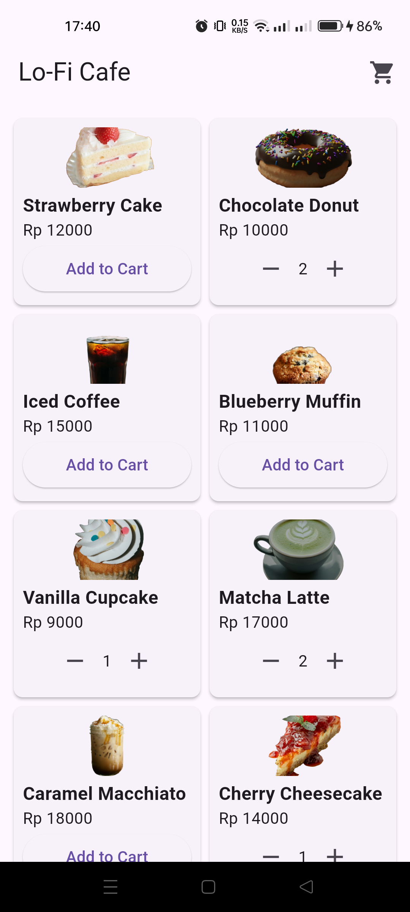
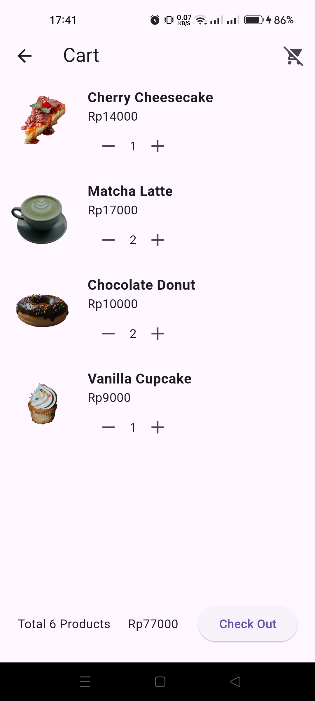

# ☕ Lo-Fi Cafe

Lo-Fi Cafe is a simple yet elegant mobile application that makes it easier for customers to order their favorite drinks and snacks from a cozy cafe setting. Built with Flutter and using `Provider` for state management, this app is designed to be lightweight, calm, and user-friendly — just like your favorite lo-fi playlist.

## ✨ Features

- 🛍️ View a list of available products
- ➕➖ Add and remove items from cart
- 🧹 Clear the entire cart
- 📦 Quantity control for each product
- ⚙️ Built using `Provider` for efficient state management
- 🎨 Soft, minimal, and relaxing UI

## 📸 Screenshots

| Home Page                        | Cart Page                        |
|----------------------------------|----------------------------------|
|  |  |


## 📦 Download

You can download the latest APK directly here:

📥 [Download APK](https://github.com/anggtpd/lofi-cafe/app-arm64-v8a-release.apk)

## 🚀 Getting Started

1. Clone the repo  
```bash
    git clone https://github.com/anggtpd/Lo-Fi_Cafe_App.git
    cd lofi-cafe   
```
2. Install dependencies
```bash
    flutter pub get
```
3. Run the app
```bash
    flutter run
```

## 🔮 Future Plans (v2)
- 🔐 Add login/logout feature
- 🧾 Order history
- 🌐 Firebase integration
- 🎧 Background lo-fi music streaming